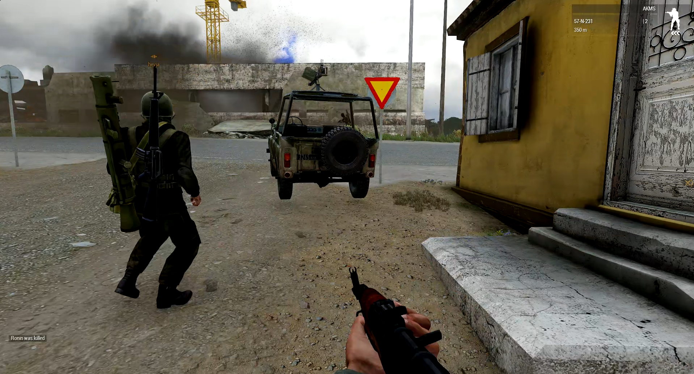

<link rel="stylesheet" href="/style.css">

# 🪖 DIVIZION M.A.D.
**Modern. Adaptive. Deadly.**  
_A hardcore Arma 3 MILSIM unit._

---

## 🎯 Mission Statement
DIVIZION M.A.D. brings elite realism to Arma 3, through tightly-coordinated teamplay, immersive operations, and a brotherhood forged in virtual fire.

---

## 🧠 Structure & Roles
- **Platoon HQ** – Strategic leadership
- **Fire Teams** – Alpha, Bravo, Charlie
- **Specialists** – Medic, Marksman, Demolitions, JTAC

---

## 📆 Upcoming Ops
| Operation | Date | Time (GMT) |
|----------|------|------------|
| Black Spear | June 10 | 2000 |
| Nightfall | June 14 | 1930 |

---

## 🎥 Media

▶️ [Watch our latest op](https://youtube.com)

---

## 📝 Enlist Now
Think you’ve got what it takes?  
👉 [Join our Discord](https://discord.gg/YOUR_INVITE)

---

## 📬 Contact
- **Discord**: `@DivizionMAD`
- **Email**: `command@divizionmad.com`

- 

---

_© 2025 DIVIZION M.A.D. – All rights reserved_
